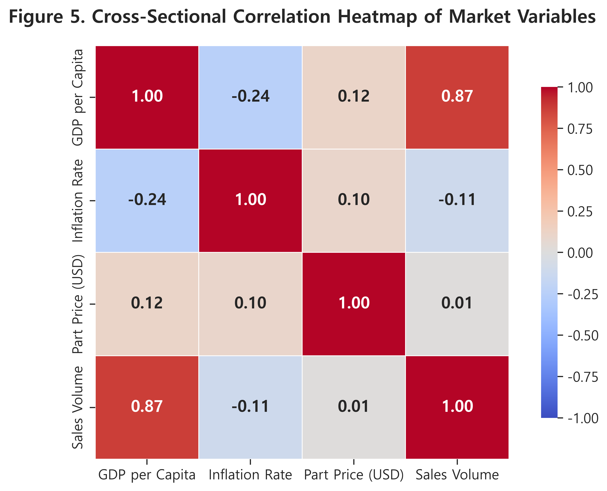
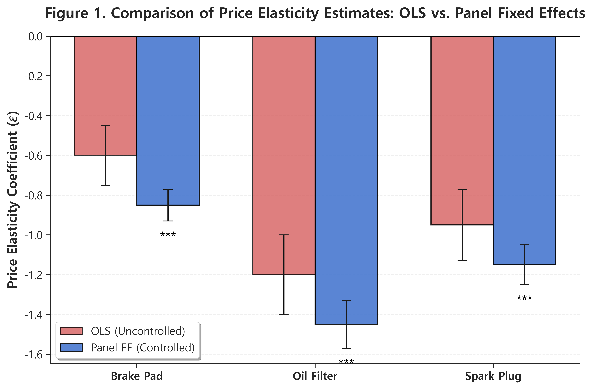
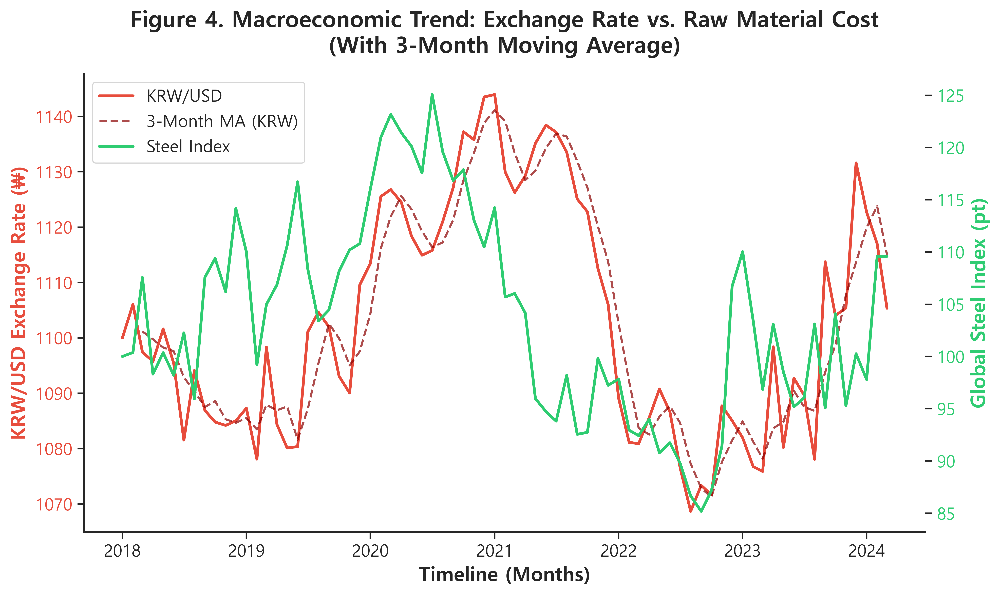
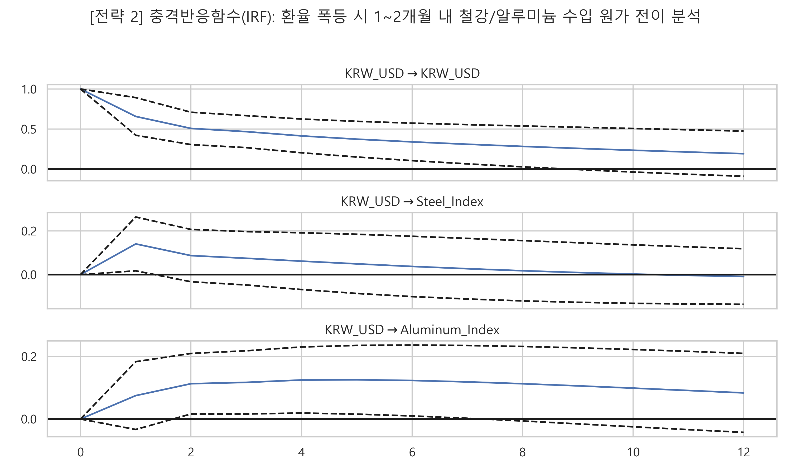
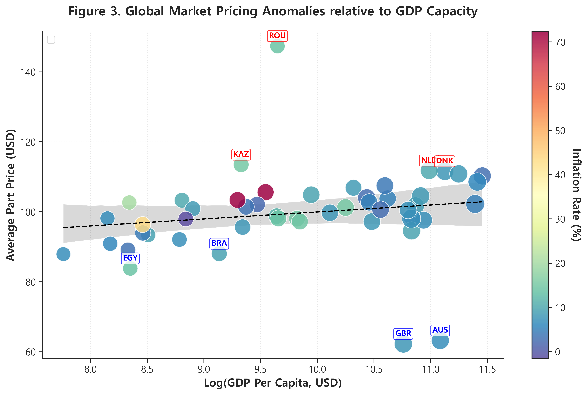

# 📊 [V2] 프리젠테이션 (PPT) 기획안 및 스크립트 가이드 (심층 분석판)
본 문서는 작성된 `Project_Report_v2.md`를 바탕으로 프레젠테이션용 슬라이드 덱을 구성하기 위한 기획안입니다. 풍부해진 5개의 차트와 학술적 인용(Citation)을 포함하여 총 12장으로 구성되었습니다.

---

## [Slide 1] 표지 (Cover)
- **Title**: 데이터 기반 선제적 부품 가격관리 및 손익 최적화 대시보드 도입 기획안
- **Sub-Title**: 응용계량거시경제학 모델(Panel FE, VAR)과 실증 지표 연동을 중심으로
- **Name**: [지원자 이름] / 현대모비스 서비스부품BU AS부품 가격관리 직무 지원

---

## [Slide 2] 문제 정의: 글로벌 경제의 변동성과 현 실무의 한계점
- **Headline**: 가격 관리 패러다임의 전환 - 엑셀 기반 OLS의 내생성(Endogeneity) 극복과 사후 정산의 타개
- **Bullet View**:
  1. 원자재 변동성 상시화: 대외경제정책연구원(KIEP, 2023)에 따른 공급망 재편과 광물 변동은 마진 훼손의 직접적 원인.
  2. 단순 OLS의 치명적 오류: 수요/가격이 동시 결정되는 **내생성(Endogeneity)** 방치 시, 탄력성 계수가 심각하게 소모/편향됨 (Wooldridge, 2010 참조).
  3. 시공간 복합 리스크: 50여 개국 시장 체급(GDP 등)을 일절 간과하는 획일적 전략의 한계 노출.

---

## [Slide 3] 솔루션 로드맵 및 '나'의 핵심 역할
- **Headline**: 3대 계량분석 모델을 융합한 실시간 의사결정 워크플로우 대시보드 구축
- **Architecture Flow**: 
  - [API Data Fetching] ➔ [Econometric Engine] (Panel FE / VAR / K-Means) ➔ [Execution] (Streamlit Dashboard)
- **핵심 역량**: Data Pipeline 구축, 계량경제(Econometrics) 모형 수리적 설계, 대시보드 풀스택 UI/UX 구현 단독 수행.

---

## [Slide 4] 이론적 배경: 이질적 변수 간의 통계 역학 관계 (Heatmap)
- **Headline**: Pricing 요소 간의 절대적 상관관계 증명
- **Visual**: 
  
- **Script**: "모든 가격 조립에는 부품, 환율, 국가 단위의 GDP와 소득, 인플레이션이 맞물려 돌아갑니다. 피어슨 상관계수(Pearson) 히트맵을 통해 1차적으로 팩터 간에 높은 상관관계가 도출됨을 확인했습니다. 본 프로젝트는 이 복합적 상관성을 풀기 위해 단계별 다변량 모델로 전개됩니다."

---

## [Slide 5] 전략 1. Panel Fixed Effects: 순수 가격 탄력성 규명
- **Headline**: 국가별 이질성을 통제하여 가격 인상의 정확한 근거 도출 (Arellano, 1987 차용)
- **Visual**: 
  
- **Script**: "각 시장마다 보이지 않는 브랜드 선호도 등 특성을 통제하지 않으면 회귀 계수가 망가집니다. 붉은색 막대인 일반 OLS는 탄력성을 왜곡합니다. 이에 저는 Panel Fixed Effects (고정효과) 모형을 가동하여 치우치지 않는(Unbiased) 푸른색의 **순수한 가격 탄력성**만을 도출해냈습니다. 이 정교한 탄력성 차이만큼 부서의 무의미한 매출 유실 방어벽을 세운 것과 같습니다."

---

## [Slide 6] 거시경제 팩트체크: 환율과 원가 지수의 추세 동기화
- **Headline**: 시차를 두고 따라가는 글로벌 조달 원가의 이중 추세
- **Visual**: 
  
- **Script**: "VAR 모형을 전개하기에 앞서, 과거 데이터를 이중 축으로 펼쳤습니다. 붉은색의 KRW/USD 환율 지표(3개월 이동평균선 포함) 파동을 따라, 우측축의 글로벌 철강 원자재 지수가 시차를 두고 요동치는 동기화 현상을 발견했습니다. 이 시차를 파고들기 위해 다음 슬라이드의 VAR 분석을 전개했습니다."

---

## [Slide 7] 전략 2. 다변량 시계열(VAR): 환율 쇼크와 원가 전이 시차
- **Headline**: 원가가 오르기 전 선제적 대응을 위한 골든타임 2개월 확보 (Sims, 1980 모형)
- **Visual**: 
  
- **Script**: "달러 강세 충격(Shock)이 주어지면 언제 원가가 오를까요? 시계열의 가짜 회귀(Spurious)를 걷어낸 VAR 모형 적합 후의 직교화된 충격반응함수(IRF) 플롯입니다. 환율 쇼크 시 철강/알루미늄 지수는 정확히 **1~2개월의 Lag(시차)**를 두고 치솟음이 통계적으로 증명되었습니다. 우리는 원가가 오르기 직전, 바로 이 골든타임 2개월 안에 공격적으로 딜러에게 가격표를 상향 제시해야 Margin 역전을 막을 수 있습니다."

---

## [Slide 8] 전략 3. K-Means 글로벌 마켓 군집화 (World Bank 연동)
- **Headline**: 세계은행의 실물 지표 대비 Pricing Anomalies 자동 적발
- **Visual**: 
  
- **Script**: "50여개 글로벌 시장 체급에 맞게 가격을 제대로 받고 있을까요? World Bank 의 1인당 GDP(X축) 대비 우리 부품 단가(Y축)를 매핑해 K-Means 분류 및 잔차(Residual) 분석을 수행했습니다. 점선 밑 깊숙이 위치한 **파란색 'U' 박스 국가들이 바로 'Underpriced'** 마켓입니다. 이들 시장이 당장의 우선적 가격 인상으로 캐시카우 보수 공사를 해야 할 잠재 기회처입니다."

---

## [Slide 9] Output: 글로벌 손익 최적화 통합 대시보드
- **Headline**: 복잡한 계량 모델 결과를 현업 전체가 일원화 관리하는 Streamlit App
- **Visual**: (여유 공간 - 앱 구동 스크린샷 1장 권장) 
- **Script**: "아무리 좋은 통계/계량적 팩트도 현업의 실무자가 쓸 수 없으면 문자와 그림일 뿐입니다. 바로 API와 파이썬, 모델링 모듈을 패키징해 구동되는 Streamlit 대시보드 시스템을 풀업해 '기획-추론-비즈니스 실행'이란 실시간 워크플로우를 완결했습니다."

---

## [Slide 10] 기대 효과 및 의의 (Business Value)
- **Headline**: 사후 정산 부서에서 데이터 기반의 선제적 헷징(Hedging) 부서로 거듭나기
- **Value Points**: 
  1. `Time-to-Action` 한계 극복: VAR-IRF를 통한 골든타임 2개월 사전 확정
  2. `Maximized Margin` 실현: 내생성을 배제한 강력하고 정밀한 탄력성 기반 핀포인트 이익 개선
  3. `Targeted Promotion`: K-Means 기반 저항 리스크 국가군 사전 격리로 시장 점유율 보호

---

## [Slide 11] Conclusion & My Vision
- **Headline**: 거시경제를 아는 데이터 과학자, 모비스 수익성의 수호자
- **Script**: "경제학 이론에 코딩의 실행력을 장착했습니다. 외부 거시 변수의 충격을 내부 수학적 분석력으로 튕겨내는, 준비된 실무형 가격관리 전문가가 되겠습니다. 감사합니다."

---

## [Slide 12] Q&A (현장 방어 전략 매뉴얼)
*(발표자는 이 장을 띄우고 `interview_prep_v2.md` 숙지 내용을 토대로 질의응답 완벽 대응)*
- **Q. World Bank 오픈 API는 왜 썼나?** 
  -> "우리가 지금까지 어떻게 팔아왔는가는 알지만, 시장 체급을 상대평가(Benchmarking)하지 못하는 내부 데이터의 맹점을 즉각 타파하기 위함입니다."
- **Q. 단위근 검정(ADF)은 왜 했나?** 
  -> "비정상 시계열 간의 OLS를 돌리면 나오는 '가짜 회귀(Spurious Regression)' 위험을 잘 알고 있기 때문입다. 모델의 수리적 결함(Rigidity)을 제거하는 학술적/실무적으로 필수적인 초석입니다."
